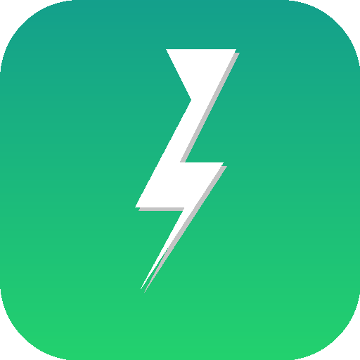

<p align="center">
  
</p>

<h1 align="center">Power Lens</h1>

<p align="center"><strong>MacBook 배터리를 소모하는 원인을 찾아보세요.</strong></p>

<p align="center">
  <a href="https://github.com/wwek/power-lens/releases"></a>
  <a href="https://github.com/wwek/power-lens/actions"></a>
  
  
  
</p>

<p align="center">
  <a href="README.md">English</a> |
  <a href="README.zh-Hans.md">简体中文</a> |
  <a href="README.zh-Hant.md">繁體中文</a> |
  <a href="README.ja.md">日本語</a> |
  <a href="README.ko.md">한국어</a>
</p>

---

Power Lens은 MacBook 배터리가 빨리 닳는 이유를 진단하는 오픈소스 macOS 메뉴 막대 앱입니다. 고전력 앱, 백그라운드 CPU 사용량, 수면 방해 앱을 식별하고 안전한 해결책을 제안합니다.

## 주요 기능

- **오픈소스** — 완전히 투명하고 커뮤니티 주도
- **로컬 실행** — 모든 분석은 Mac에서 수행, 데이터 업로드 없음
- **원격 측정 없음** — 추적, 분석, 데이터 전송 없음
- **앱 수준 진단** — 프로세스를 앱으로 집계하여 점수 매기기
- **수면 방해 감지** — Mac의 수면을 방해하는 앱 찾기
- **개발자 친화적** — Docker, 개발 서버, VS Code, Cursor 등 감지
- **안전한 제안** — 원인을 설명하고 조치를 제안, 프로세스를 자동 종료하지 않음
- **다국어** — English、简体中文、繁體中文、日本語、한국어

## 시스템 요구사항

- macOS 14 Sonoma 이상
- Apple Silicon 또는 Intel Mac

## 설치

### 다운로드

[Releases](../../releases)에서 최신 `Power Lens.dmg`를 다운로드하세요.

### Homebrew

```bash
brew install --cask power-lens
```

### 소스에서 빌드

```bash
git clone https://github.com/wwek/power-lens.git
cd power-lens
open PowerLens.xcodeproj
# Cmd+R을 눌러 빌드 및 실행
```

또는 명령줄에서:

```bash
xcodebuild -project PowerLens.xcodeproj -scheme "Power Lens" -configuration Debug build
```

## 사용 방법

1. 메뉴 막대 아이콘을 클릭하여 현재 배터리 상태 및 전력 소비 수준 확인
2. 전력 점수(0–100) 순위별 고전력 앱 확인
3. 원인 태그로 각 앱이 전력을 소비하는 이유 확인
4. 배터리 수명을 연장하기 위한 실행 가능한 제안 받기
5. Mac의 수면을 방해하는 앱이 있는지 확인

## 기술 스택

- **언어:** Swift 6.2
- **UI:** SwiftUI + `MenuBarExtra`
- **데이터 수집:** IOKit(배터리), `ps`(프로세스), IOKit PM(수면 어서션)
- **저장소:** GRDB.js (SQLite)
- **최소 타겟:** macOS 14 Sonoma

## 프로젝트 구조

```
PowerLens/
├── App/                  # 앱 진입점, 메뉴 막대 패널, 뷰 모델
├── Collectors/           # 배터리, 프로세스, 수면 어서션 수집기
├── Models/               # 데이터 모델
├── Scoring/              # 전력 점수 계산
├── Recommendations/      # 규칙 기반 추천 엔진
├── Storage/              # GRDB 이벤트 저장소
└── Resources/            # 에셋, Info.plist, 현지화
```

## 기여

기여를 환영합니다! 언제든지 Pull Request를 제출해 주세요.

## 라이선스

[GPLv3](LICENSE)
